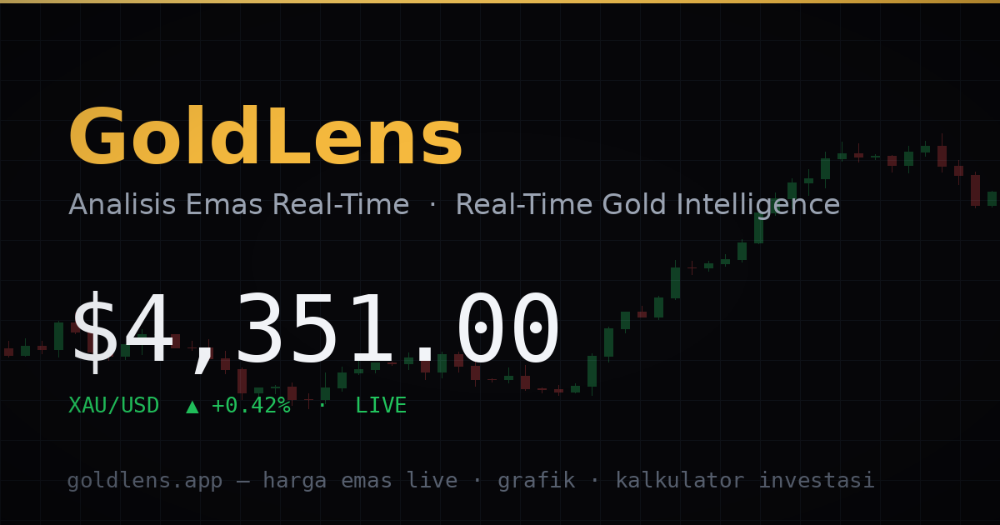

<p align="center">
  
</p>

# EmasKuy

[](https://github.com/taufiksoleh/emaskuy/actions/workflows/deploy-pages.yml)

**Live gold price intelligence for Indonesian investors.**

EmasKuy (*emas* is Indonesian for gold) is a real-time gold analysis terminal. It shows live gold prices per gram in rupiah or in any of 15 other currencies, and Antam, Galeri24 and UBS retail prices. It has daily history charts back to 2013, market analysis, gold calculators (investment, zakat, jewelry and savings target), a portfolio tracker and price alerts. It runs entirely in the browser, with no backend and no API keys, in Indonesian and English, and it can be installed as an app.

**Live site: <https://emaskuy.com>** (English: <https://emaskuy.com/en>)

## Features

### Dashboard (`/`, `/en`)

- **Ticker strip** with live spot prices:
  - gold (XAU), silver (XAG), platinum (XPT) and palladium (XPD);
  - USD/IDR and gold in rupiah per gram;
  - the visitor's own currency when it is neither, e.g. USD/MYR and XAU/MYR.
- **Hero price panel** in the display currency and weight, with the 24h change, the range seen today and a 30-day sparkline. It shares to WhatsApp as a text message or an image card.
- **Currency and weight picker** in the navbar, applied site-wide.
  - **Currencies:** IDR, USD, MYR, SGD, HKD, JPY, KRW, CNY, THB, PHP, INR, SAR, AED, EUR, GBP and AUD.
  - **Weights:** gram, troy ounce, kilogram, tola, tael (Hong Kong) or mayam (Aceh, ≈3.33 g).
  - **Default:** follows the visitor's time zone, else the site language.
- **Interactive price chart** (lightweight-charts): line, area or candles over 1H, 24H, 7D, 30D, 90D, 1Y and ALL (daily history back to 2013).
- **AI Insight:** a daily market sentiment with three or four bullets and their sources.
- **Price alerts** above or below a target, in any currency and weight (up to 10).
  - Checked on every page while the site is open, including once a minute in a background tab.
  - Shown as a toast, and as a system notification if allowed.
- **Antam prices:**
  - the 1 g and buyback prices, the spread and the premium over spot;
  - every bar size the source quotes, and Galeri24 and UBS when quoted;
  - a chart of Antam, buyback and spot.

  Antam is the state-owned miner PT Aneka Tambang, whose gold bars are Indonesia's most common retail reference price.
- **Market stats:** 52-week high/low, 30-day volatility, a metals table and a quick converter.

### Metal pages (`/logam/perak`, `/en/metals/silver`, …)

Silver, platinum and palladium, each with:
- the live price in the display units, with its change since this browser's first price of the day;
- a chart of the prices recorded in this browser;
- gold ratios and a converter.

### Analysis (`/analisis`, `/en/analysis`)

- **Articles:** bilingual market analysis with a category filter, live search and a featured story.
- **Reader:** reading progress, a table of contents, live-price callouts, sources, share buttons and related articles.
- **Newsletter:** sign-up through an email provider when one is configured (see [Getting started](#getting-started)).

### Calculators (`/kalkulator`, `/en/calculator`)

- **Investment:** a lump-sum or monthly DCA purchase over 1 to 30 years.
  - Inputs: assumed growth and dealer spread, in the local currency or USD.
  - Output: a year-by-year table and projection chart, plus a Scenario Lab comparing 5/8/12 % growth.
- **Zakat** (`/zakat`): nisab 85 g of pure gold and 2.5 % after a lunar year. It covers stored or worn jewelry and shows progress toward the nisab.
- **Jewelry** (`/perhiasan`, `/jewelry`): the gold value of jewelry by karat or purity, with an estimated resale price.
- **Target** (`/target`): how much to save each month to own a set amount of gold (dowry, umrah, education, …).
- **Price basis:** every calculator can use the live spot price, Antam's selling or buyback price, or a typed price.

### Portfolio (`/portofolio`, `/en/portfolio`)

- **Holdings:** type (Antam, UBS, Galeri24, Lotus Archi, digital, jewelry, other), weight, purity for jewelry, and buy price in any currency.
- **Totals:** grams, invested, current value and profit/loss in the display currency.
- **Valuation:** at spot, or at the buyback price (rupiah bars; Galeri24 and UBS at their own quote when available).
- **Backup:** export JSON and CSV (Excel-friendly in Indonesian), import with merge, and a hand-off to the zakat calculator.
- **Privacy:** data stays in the browser.

### Across the app

- **Two languages, two sets of URLs.**
  - Indonesian at the root and English under `/en`; the language toggle moves to the same page in the other language.
  - A visitor whose browser prefers the other language gets an offer, never a redirect.
- **Every page is prerendered** with its own title, description, canonical, hreflang, link preview and structured data, so it is indexable and previews well on WhatsApp.
- **Installable (PWA):** works offline with the last saved prices.
- **Theme:** dark by default, with a light theme.
- **Data status:** `LIVE`, `CACHE` and `OFFLINE` badges.

## Tech stack

| Area | Choice |
| --- | --- |
| Framework | React 19, TypeScript ~5.9 (strict), Vite 7 |
| Routing | react-router 7 (`<BrowserRouter>`); routes for both languages come from `src/lib/routes.ts` |
| Styling | Tailwind CSS 3.4 with CSS-variable design tokens (`src/index.css`) |
| Charts | lightweight-charts for the price chart; hand-drawn SVG elsewhere |
| Motion | framer-motion; GSAP + ScrollTrigger and Lenis on the Article and About pages |
| UI | The app's own primitives in `src/components/ui-atoms/`, Radix Dialog/Accordion/Slider in `src/components/ui/`, lucide-react icons, sonner toasts |
| Fonts | Space Grotesk, JetBrains Mono and Inter, self-hosted with @fontsource-variable |
| PWA | vite-plugin-pwa (Workbox) |
| SEO | Build-time prerender of every page in both languages (`vite/seo-prerender.ts`, `src/seo/prerender.ts`), sitemap and RSS |
| Tests | Vitest |
| Hosting | GitHub Pages via GitHub Actions, on emaskuy.com |

## Getting started

**Prerequisites:** Node.js 22 (as in CI; Vite 7 needs 20.19+ or 22.12+) and npm.

```bash
git clone https://github.com/taufiksoleh/emaskuy.git
cd emaskuy
npm ci
npm run dev     # http://localhost:3000
```

No API key is needed: every data source is a public API called from the browser. Two optional features read environment variables (see `.env.example`; in production they come from repository variables):
- **Newsletter:** `VITE_NEWSLETTER_ACTION`, `VITE_NEWSLETTER_EMAIL_FIELD` and `VITE_NEWSLETTER_EXTRA` post the form to Buttondown, Kit or MailerLite. Without them the form is hidden.
- **Analytics:** `VITE_CF_BEACON_TOKEN` adds cookieless Cloudflare Web Analytics.

| Script | What it does |
| --- | --- |
| `npm run dev` | Dev server on port 3000 (makes the WebP image copies first) |
| `npm run build` | Type-checks (`tsc -b`), bundles, and prerenders every page into `dist/` |
| `npm run preview` | Serves the production build locally |
| `npm test` | Unit tests (Vitest) |
| `npm run lint` | ESLint |
| `npm run validate:content` | Checks the daily content files (see [docs/content-pipeline.md](docs/content-pipeline.md)) |
| `node scripts/verify-dist.mjs` | Checks the built site: one title per page, canonical/hreflang/og tags, JSON-LD, sitemap, feeds |

The `@` import alias points to `src/`.

## Data sources and how it works

### Sources

| Source | Endpoint | Used for |
| --- | --- | --- |
| gold-api.com | `https://api.gold-api.com/price/{XAU,XAG,XPT,XPD}` | Live spot prices in USD per troy ounce |
| Frankfurter | `https://api.frankfurter.dev/v1/…?base=USD` | ECB reference rates for 13 currencies over the last ten days (one request), and daily series per currency for the charts |
| NBP | `https://api.nbp.pl/api/cenyzlota/…` | Daily gold fixings in PLN per gram from the National Bank of Poland, back to 2013 |

All requests are plain `fetch` calls from the browser (9 s timeout, no keys).
- **Live prices:** one shared poller, `useGoldPrice`, refreshes the metals every 30 seconds and the rates every 30 minutes. Components read from it.
- **Paused polling:** it stops in a hidden tab unless a price alert is armed; then it checks once a minute.
- **History:** loaded per chart range and cached.

```text
gold-api.com (4 metals) ─┐ every 30 s
Frankfurter  (rates)    ─┴─▶ useGoldPrice ─▶ ticker, hero, alerts, calculators, portfolio, metal pages
NBP + Frankfurter (daily) ──▶ useHistory / useDisplayHistory ─▶ charts, stats
src/content/*.json        ──▶ AI Insight, Antam prices   (written daily by the content agent)
src/data/articles.ts      ──▶ articles
```

### Conversion

```text
price per weight = USD/oz ÷ 31.1034768 × grams per unit × units of currency per USD
```

SAR and AED use their official dollar pegs (3.75 and 3.6725); the other currencies use ECB reference rates.

### How some numbers are derived

- **Price history.** Each NBP fixing (PLN per gram) is converted with the same day's ECB rate. Every point is a real price in its own day's money. Other currencies use their own daily series.
- **24h change.**
  - gold-api.com's free tier has no previous close, so gold's change is measured against the previous NBP close, valued at that day's rate in the display currency.
  - Silver, platinum and palladium show the change since this browser first saw a price (kept up to 26 hours).
- **1H and 24H chart.** Only prices this browser actually recorded. A fresh browser shows "collecting" until there are two points; candles exist only for these ranges.

### Status and fallback

Every fetch reports `live`, `cached` or `offline`. A failed request falls back to the last good response in localStorage (`CACHE`); with nothing cached the value shows `OFFLINE`. There are no placeholder prices.

### What is live and what is static

| Data | Kind | Notes |
| --- | --- | --- |
| Metal prices and exchange rates | Live | Every 30 s (rates every 30 min) |
| Price history | Live, derived | NBP fixings at the same day's rate |
| AI Insight (`src/content/ai-insight.json`) | Static file | Written daily by an AI content agent outside this repo, through a pull request checked in CI ([docs/content-pipeline.md](docs/content-pipeline.md)); no model runs on the site |
| Antam prices (`src/content/antam.json`) | Static file | Same agent: bar prices by size, buyback, optional Galeri24/UBS quotes and a daily history |
| Articles (`src/data/articles.ts`) | Static | Bilingual; added by the agent or through commits |

## Calculator model

Implemented in `src/lib/calc.ts`:

```text
r_m       = (1 + annual growth) ^ (1/12) - 1              monthly growth rate
price(m)  = buy price × (1 + r_m) ^ m                     gold price at month m
grams    += contribution ÷ (price(m) × (1 + spread))      grams bought that month
value(m)  = grams × price(m)                              portfolio value at month m
```

The initial amount is invested at month 0 in both modes; DCA also invests the monthly amount every month. Growth is constant, the spread is charged on purchase only, the final value is marked at the chosen price basis, and inflation and taxes are ignored. The zakat, jewelry and target formulas are in `src/lib/{zakat,jewelry,target}.ts`.

## Browser storage and privacy

There is no backend and no account. The app keeps these in localStorage:

| Key | Contents |
| --- | --- |
| `emaskuy.display.v1` | Display currency and weight |
| `emaskuy.lang` | Language choice (the page language comes from the URL) |
| `emaskuy.theme` | `dark` or `light` |
| `emaskuy.portfolio.v2` | Portfolio holdings |
| `emaskuy.portfolio.valuation` | `spot` or `buyback` |
| `emaskuy.alerts.v2` | Price alerts |
| `emaskuy.ticks.{xau,xag,xpt,xpd}` | Prices recorded in the last 24 h (charts) |
| `emaskuy.sessionbase` | First prices seen, for the non-gold metals' change |
| `emaskuy.cache.*` | Last good API responses and history, for offline use |
| `emaskuy.storage.v` | Storage migration version |

Older keys (`emaskuy.unit`, `emaskuy.alerts`, `emaskuy.portfolio`) are migrated on first load and left in place.

**Outside requests.** Apart from the three APIs above, the browser only contacts:
- the newsletter provider, when someone submits the form;
- Cloudflare Web Analytics, if configured (cookieless).

The site uses no trackers or cookies.

## Project structure

```text
.
├── .github/workflows/        # deploy-pages.yml (main → GitHub Pages), pr-check.yml (every PR)
├── docs/content-pipeline.md  # contract for the daily content agent
├── scripts/                  # images.mjs (WebP/OG copies), verify-dist.mjs, validate-content.mjs, content-schema.mjs, gen-icons.mjs
├── vite/seo-prerender.ts     # build step that writes the prerendered pages
├── public/                   # copied into dist/: CNAME, 404.html, icons, images, sw-notify.js
├── src/
│   ├── main.tsx              # entry: router, storage migration, alert watcher
│   ├── App.tsx               # providers, layout, routes for both languages
│   ├── pages/                # Home, Analysis, Article, Calculator + calculator/*, Portfolio, Metal, About, NotFound
│   ├── components/           # home/, analysis/, calculator/, portfolio/, share/, about/, ui-atoms/, ui/, Navbar, Footer, DisplayPicker
│   ├── hooks/                # useGoldPrice (poller), useHistory, useDisplay, usePriceAlerts, usePortfolio, …
│   ├── lib/                  # api, money, history, routes, seo, i18n, calc, zakat, portfolio, alerts, antam, …
│   ├── seo/prerender.ts      # prerendered HTML, sitemap, RSS
│   ├── content/              # antam.json, ai-insight.json (daily)
│   └── data/                 # articles
├── index.html
└── vite.config.ts, tailwind.config.js, eslint.config.js, vitest.config.ts, tsconfig*.json
```

## Deployment

Pushes to `main` deploy to GitHub Pages through `.github/workflows/deploy-pages.yml` (also runnable by hand).

```text
push to main ─▶ npm ci ─▶ validate:content ─▶ npm test ─▶ npm run build ─▶ verify-dist ─▶ GitHub Pages
```

- **One-time setup:** Settings → Pages → Source: **GitHub Actions**.
- **Custom domain:** `public/CNAME` (`emaskuy.com`) is copied into every build.
- **Routing:**
  - Every page is a prerendered file: `/kalkulator` is served from `kalkulator.html` and `/en/calculator` from `en/calculator.html`, both with HTTP 200.
  - Only unknown URLs get `public/404.html`, which hands them to the app to show its "not found" page.
  - A folder must not get its own `index.html`, or GitHub Pages would redirect `/kalkulator` to `/kalkulator/`; `verify-dist` checks this.
- **PWA:** the service worker updates itself on the next navigation after a deploy.
- **Base path:** `base: '/'` in `vite.config.ts`; the router basename and `withBase()` read Vite's `BASE_URL`.

## Development workflow

1. Create a branch and open a pull request.
2. **PR Check** runs `npm ci`, `npm run lint`, `npm run validate:content`, `npm test`, `npm run build` and `node scripts/verify-dist.mjs`. Lint is reported but doesn't block (there is pre-existing lint debt); everything else must pass. It also runs for PRs stacked on another PR's branch.
3. Merging to `main` deploys.

Conventions:

- **Imports:** from `src/` with the `@/` alias.
- **Copy:** bilingual. Register strings with `registerStrings({ key: { id, en } })` and read them with `t('key')` from `useI18n()`.
- **Links:** built with `pathFor()`, `articlePath()` or `metalPath()` from `src/lib/routes.ts`, so they stay in the current language.
- **Prices:** come from `useGoldPrice()`; show them with `useDisplay()` (the visitor's currency and weight).
- **Content files:** `src/content/*.json` follow a contract ([docs/content-pipeline.md](docs/content-pipeline.md), `scripts/content-schema.mjs`). Change it only together with the content agent's prompt.

## Known limitations

- **Alerts** only run while an EmasKuy tab is open; there is no push server. On iPhone and iPad, notifications need the app installed to the Home Screen (iOS 16.4+).
- **Charts:** the 1H and 24H charts, and the metal pages' charts, only show prices recorded in this browser. The free price API has no intraday or long history for these.
- **Rates:** exchange rates are ECB reference rates, published once per business day. TWD isn't covered.

## Disclaimer

> EmasKuy content is for informational and educational purposes only — not financial advice. Data may be delayed. Past performance does not guarantee future results.

## Contact

[halo@emaskuy.com](mailto:halo@emaskuy.com)
